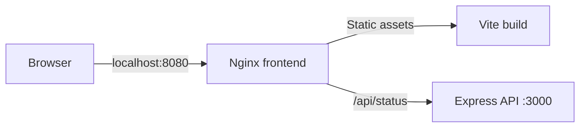

# Null Archive

> A containerized terminal-style portfolio emerging from the void.

Null Archive packages [0xgoz.xyz](https://0xgoz.xyz) as a small two-service application. The interactive frontend combines a retro boot sequence, terminal commands, and a Three.js particle field; an Express API supplies live runtime status through an Nginx reverse proxy.

## Highlights

- Interactive terminal with `matrix`, `shapes`, `status`, and `clear` commands
- Three.js particle field, wireframe geometry, CRT effects, and responsive layouts
- Multi-stage frontend image that builds with Node and serves from Nginx
- Same-origin `/api/status` proxy backed by a private Express service
- Docker Compose networking with no host port exposed for the API
- Guided Docker and Compose tutorials included in the repository

## Architecture



Nginx is the only service exposed to the host. Compose provides internal DNS for the `api` service, allowing Nginx to proxy API requests without publishing port `3000`.

## Run with Docker

Requirements: Docker with the Compose plugin.

```bash
git clone https://github.com/0xgoz/null-archive.git
cd null-archive
docker compose up --build
```

Open [http://localhost:8080](http://localhost:8080), finish or skip the boot sequence, then enter `status` in the terminal.

Stop the stack with `Ctrl+C`, followed by:

```bash
docker compose down
```

## Frontend development

Requirements: Node.js 22.12 or newer.

```bash
npm ci
npm run dev
```

This starts the Vite development server for the frontend. The `status` command depends on the Nginx-to-Express route provided by the Compose stack, so use Docker when testing the complete application.

Create a production build with:

```bash
npm run build
```

## Project layout

```text
.
├── api/                 Express status service
├── docs/
│   ├── tutorials/       Guided Docker and Compose walkthroughs
│   └── superpowers/     Implementation plans and specifications
├── nginx/               Reverse-proxy configuration
├── src/html/            Portfolio source and image assets
├── compose.yml          Frontend and API orchestration
└── Dockerfile           Multi-stage frontend image
```

## Stack

- HTML, CSS, and JavaScript
- [Three.js](https://threejs.org/)
- [Vite](https://vite.dev/)
- [Express](https://expressjs.com/)
- [Nginx](https://nginx.org/)
- Docker and Docker Compose

## Learn how it works

- [Build the site with a multi-stage Dockerfile](docs/tutorials/multi-stage-docker.md)
- [Connect the frontend and Express API with Docker Compose](docs/tutorials/express-compose.md)
